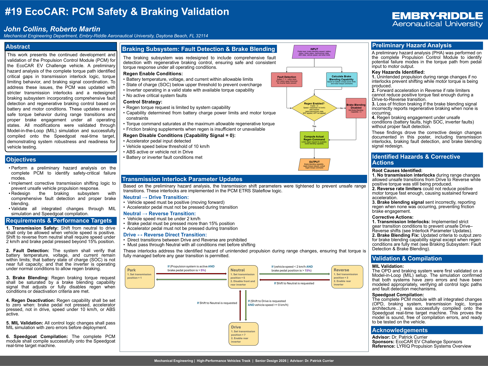
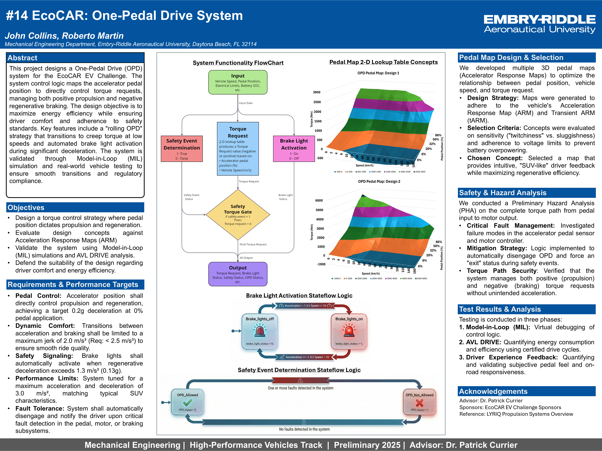

> [!IMPORTANT]
> **Proprietary Information & NDA Compliance**
> This project was completed as part of the EcoCAR EV Challenge in partnership with General Motors and the U.S. Department of Energy. Due to the proprietary nature of the vehicle platform (Cadillac LYRIQ) and competition-specific software, certain technical models, source code, and detailed CAD data are protected under a Non-Disclosure Agreement (NDA). The documentation provided here focuses on high-level system architecture, control logic methodology, and safety-critical analysis permitted for public disclosure.
# EcoCAR EV Challenge: One-Pedal Drive & Braking System
**Co-Lead Simulink Engineer | Model-Based Design | System Safety**

## Project Overview
Redesigned the One-Pedal Drive (OPD) and braking architecture for a Cadillac LYRIQ. This involved complex integration of regenerative braking and friction braking to ensure a seamless driver experience and system safety.

## Technical Contributions
* **Braking System Redesign:** Integrated friction brake blending with regenerative braking models in Simulink.
* **Control Architecture:** Developed 2D pedal maps to calibrate torque demand vs. pedal travel.
* **Safety Engineering:** Conducted a formal **Preliminary Hazard Analysis (PHA)**, ensuring automatic system disablement and driver notification during critical faults.
* **Validation:** Iteratively tuned control gains to balance energy recovery with luxury vehicle "feel".

## Tools Used
* **Modeling:** Simulink, MATLAB.
* **Hardware-in-the-Loop:** Vehicle software integration.

---

## 📊 Technical Presentations & Research

Click to expand the details for each project phase:

<b>📋 2026: EcoCAR PCM Safety & Braking Validation (Spring)</b>

 

### EcoCAR: PCM Safety & Braking Validation
* **Focus:** Senior Design 2026 | Mechanical Engineering
* **Objective:** Conducted a Preliminary Hazard Analysis (PHA) of the Propulsion Control Module (PCM), implemented strict transmission interlocks, and redesigned the braking subsystem with comprehensive fault detection.
* **Validation:** All logic was verified via Model-in-the-Loop (MIL) simulation and compiled onto a Speedgoat real-time target.

<b>📋 2025: EcoCAR One-Pedal Drive System (Fall)</b>

 

### EcoCAR: One-Pedal Drive System
* **Focus:** Preliminary 2025 | Mechanical Engineering
* **Objective:** Designed an OPD control architecture mapping accelerator pedal position to manage both propulsion and regenerative braking.
* **Key Features:** Developed 3D Accelerator Response Maps (ARM), implemented "rolling OPD" creep torque strategies, and validated system comfort via AVL DRIVE analysis.

